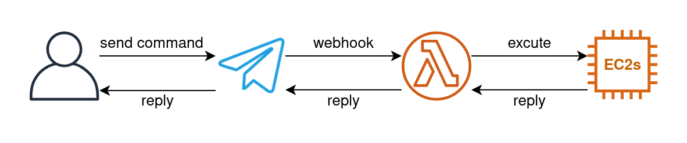
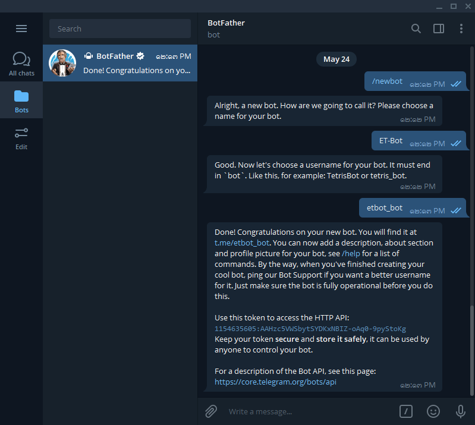
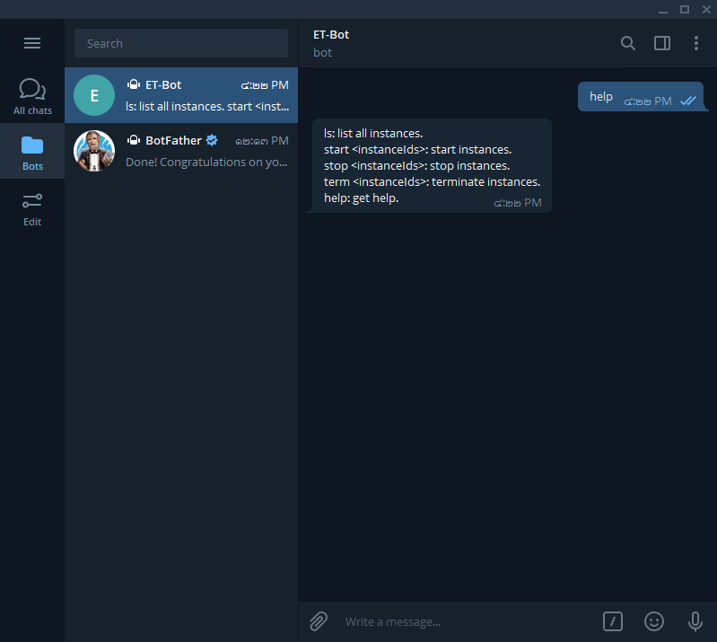
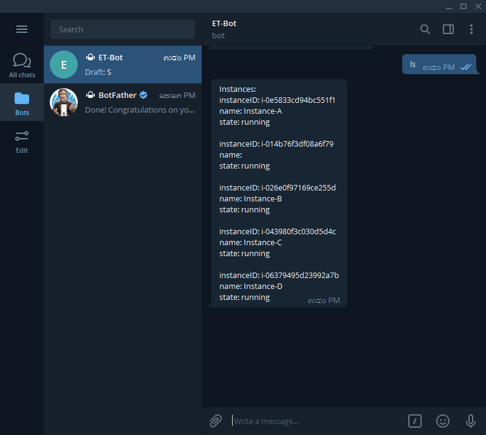
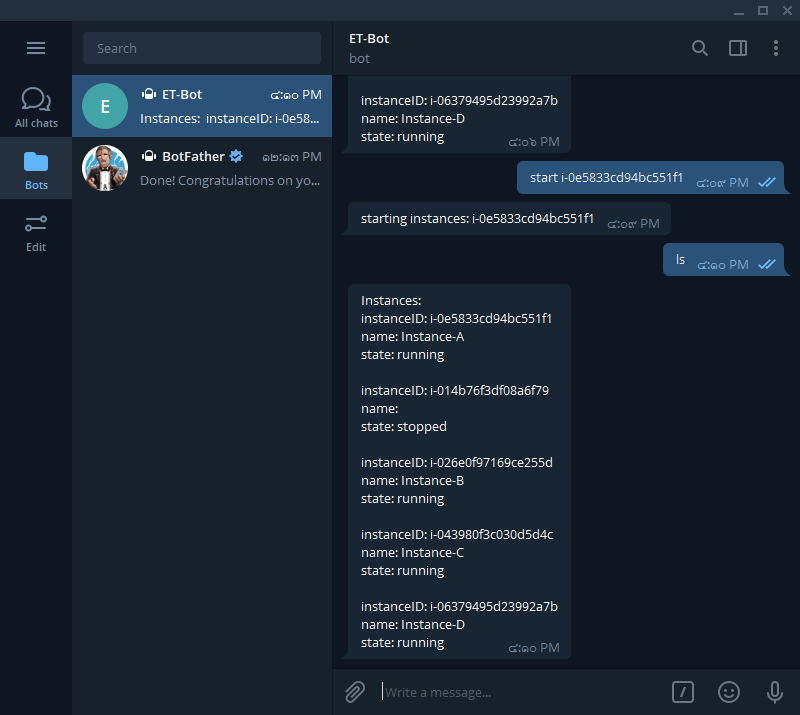
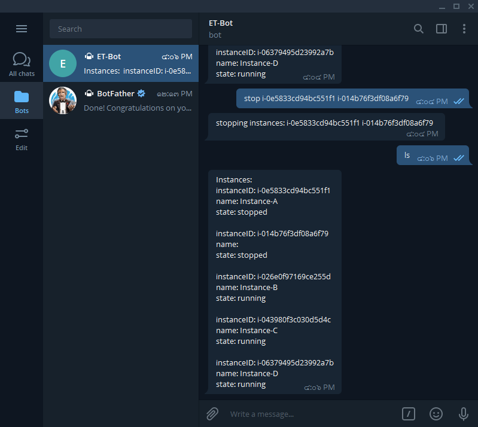
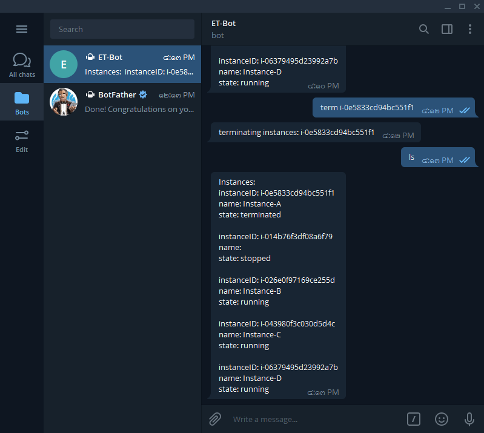

# ET-Bot
The ET-bot (E for AWS EC2 and T for Telegram) is a telegram bot that can manage (list, start, stop and terminate) AWS EC2 instances.

## ET-Bot Diagram
<p align=center></p>


## Getting Started
### Installation and Configuration
1. Install the Serverless framework and other modules.

```
$ npm install -g serverless
$ npm install
```

2. Create a new bot using Telegram BotFather.
```
/newbot
```
<p align=center></p>

3. Configure Telegram bot token.
```
$ export TELEGRAM_TOKEN=<Telegram Token>
```
4. Configure AWS credential.
```
$ export AWS_ACCESS_KEY_ID=<Access key ID>
$ export AWS_SECRET_ACCESS_KEY=<Secret access key>
```
5. Deploy.
```
$ serverless deploy
```
6. Configure webhook.
```
$ curl --request POST --url https://api.telegram.org/bot<Telegram Token>/setWebhook --header 'content-type: application/json' --data '{"url": "<API Gateway Endpoint>"}'
```
### Using bot
Type 'help' for getting help.
<p align=center></p>
Type 'ls' for listing all EC2 instances.
<p align=center></p>
Type 'start &ltinstancesIds&gt' for start instances.
<p align=center></p>
Type 'stop &ltinstancesIds&gt' for stop instances.
<p align=center></p>
Type 'term &ltinstancesIds&gt' for terminate instances.
<p align=center></p>